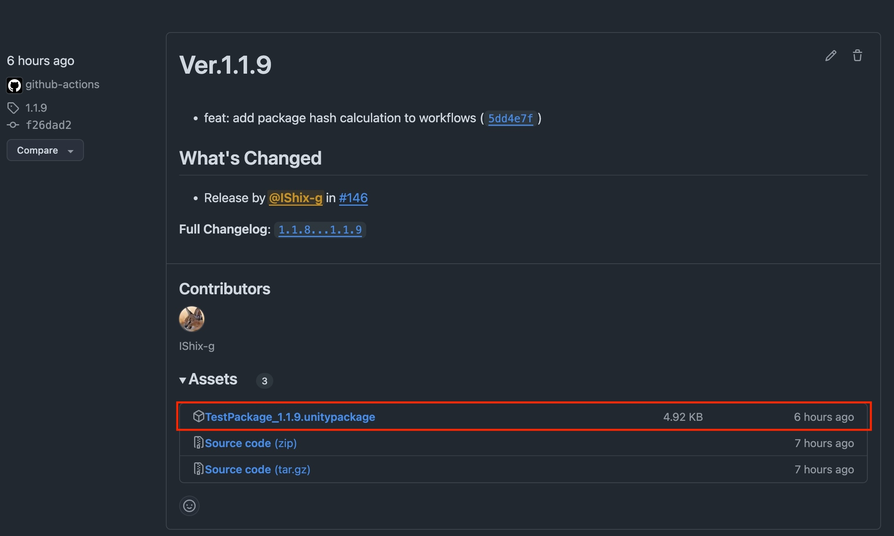

# Unity-GitHubActions
GitHub Actions for Unity.

## 目次

<!-- START doctoc generated TOC please keep comment here to allow auto update -->
<!-- DON'T EDIT THIS SECTION, INSTEAD RE-RUN doctoc TO UPDATE -->
<details>
<summary>Details</summary>

- [実現すること](#%E5%AE%9F%E7%8F%BE%E3%81%99%E3%82%8B%E3%81%93%E3%81%A8)
  - [リリースノート](#%E3%83%AA%E3%83%AA%E3%83%BC%E3%82%B9%E3%83%8E%E3%83%BC%E3%83%88)
    - [利用可能なタイプ一覧](#%E5%88%A9%E7%94%A8%E5%8F%AF%E8%83%BD%E3%81%AA%E3%82%BF%E3%82%A4%E3%83%97%E4%B8%80%E8%A6%A7)
- [必須の設定](#%E5%BF%85%E9%A0%88%E3%81%AE%E8%A8%AD%E5%AE%9A)
- [環境別の設定](#%E7%92%B0%E5%A2%83%E5%88%A5%E3%81%AE%E8%A8%AD%E5%AE%9A)
  - [ブランチ保護またはタグ保護が有効な場合](#%E3%83%96%E3%83%A9%E3%83%B3%E3%83%81%E4%BF%9D%E8%AD%B7%E3%81%BE%E3%81%9F%E3%81%AF%E3%82%BF%E3%82%B0%E4%BF%9D%E8%AD%B7%E3%81%8C%E6%9C%89%E5%8A%B9%E3%81%AA%E5%A0%B4%E5%90%88)
  - [Test Framework (旧 Test Runner)またはパッケージを生成したい場合](#test-framework-%E6%97%A7-test-runner%E3%81%BE%E3%81%9F%E3%81%AF%E3%83%91%E3%83%83%E3%82%B1%E3%83%BC%E3%82%B8%E3%82%92%E7%94%9F%E6%88%90%E3%81%97%E3%81%9F%E3%81%84%E5%A0%B4%E5%90%88)
  - [必要情報](#%E5%BF%85%E8%A6%81%E6%83%85%E5%A0%B1)
- [手動でのリリース](#%E6%89%8B%E5%8B%95%E3%81%A7%E3%81%AE%E3%83%AA%E3%83%AA%E3%83%BC%E3%82%B9)
  - [手動でリリースまでの流れ](#%E6%89%8B%E5%8B%95%E3%81%A7%E3%83%AA%E3%83%AA%E3%83%BC%E3%82%B9%E3%81%BE%E3%81%A7%E3%81%AE%E6%B5%81%E3%82%8C)
  - [セットアップガイド](#%E3%82%BB%E3%83%83%E3%83%88%E3%82%A2%E3%83%83%E3%83%97%E3%82%AC%E3%82%A4%E3%83%89)
- [プルリクエストでのリリース](#%E3%83%97%E3%83%AB%E3%83%AA%E3%82%AF%E3%82%A8%E3%82%B9%E3%83%88%E3%81%A7%E3%81%AE%E3%83%AA%E3%83%AA%E3%83%BC%E3%82%B9)
  - [リリース作成の条件](#%E3%83%AA%E3%83%AA%E3%83%BC%E3%82%B9%E4%BD%9C%E6%88%90%E3%81%AE%E6%9D%A1%E4%BB%B6)
  - [プルリクエストを介したリリースの流れ](#%E3%83%97%E3%83%AB%E3%83%AA%E3%82%AF%E3%82%A8%E3%82%B9%E3%83%88%E3%82%92%E4%BB%8B%E3%81%97%E3%81%9F%E3%83%AA%E3%83%AA%E3%83%BC%E3%82%B9%E3%81%AE%E6%B5%81%E3%82%8C)
  - [セットアップガイド](#%E3%82%BB%E3%83%83%E3%83%88%E3%82%A2%E3%83%83%E3%83%97%E3%82%AC%E3%82%A4%E3%83%89-1)
- [推奨事項](#%E6%8E%A8%E5%A5%A8%E4%BA%8B%E9%A0%85)
- [Unity Test Framework (旧 Test Runner)の実行を追加する](#unity-test-framework-%E6%97%A7-test-runner%E3%81%AE%E5%AE%9F%E8%A1%8C%E3%82%92%E8%BF%BD%E5%8A%A0%E3%81%99%E3%82%8B)
  - [テストについて](#%E3%83%86%E3%82%B9%E3%83%88%E3%81%AB%E3%81%A4%E3%81%84%E3%81%A6)
  - [Workflowの参考](#workflow%E3%81%AE%E5%8F%82%E8%80%83)
  - [現在のWorkflowに追加する場合](#%E7%8F%BE%E5%9C%A8%E3%81%AEworkflow%E3%81%AB%E8%BF%BD%E5%8A%A0%E3%81%99%E3%82%8B%E5%A0%B4%E5%90%88)
  - [Modeを指定したい](#mode%E3%82%92%E6%8C%87%E5%AE%9A%E3%81%97%E3%81%9F%E3%81%84)
    - [コード例 (初期値)](#%E3%82%B3%E3%83%BC%E3%83%89%E4%BE%8B-%E5%88%9D%E6%9C%9F%E5%80%A4)
    - [実行結果のサンプル](#%E5%AE%9F%E8%A1%8C%E7%B5%90%E6%9E%9C%E3%81%AE%E3%82%B5%E3%83%B3%E3%83%97%E3%83%AB)
- [パッケージの生成を追加する](#%E3%83%91%E3%83%83%E3%82%B1%E3%83%BC%E3%82%B8%E3%81%AE%E7%94%9F%E6%88%90%E3%82%92%E8%BF%BD%E5%8A%A0%E3%81%99%E3%82%8B)
  - [パッケージの生成について](#%E3%83%91%E3%83%83%E3%82%B1%E3%83%BC%E3%82%B8%E3%81%AE%E7%94%9F%E6%88%90%E3%81%AB%E3%81%A4%E3%81%84%E3%81%A6)
  - [&#91;注意&#93; パッケージが生成できない環境](#%E6%B3%A8%E6%84%8F-%E3%83%91%E3%83%83%E3%82%B1%E3%83%BC%E3%82%B8%E3%81%8C%E7%94%9F%E6%88%90%E3%81%A7%E3%81%8D%E3%81%AA%E3%81%84%E7%92%B0%E5%A2%83)
    - [パスの例](#%E3%83%91%E3%82%B9%E3%81%AE%E4%BE%8B)
  - [現在のWorkflowに追加する場合](#%E7%8F%BE%E5%9C%A8%E3%81%AEworkflow%E3%81%AB%E8%BF%BD%E5%8A%A0%E3%81%99%E3%82%8B%E5%A0%B4%E5%90%88-1)
  - [Unity Editorで必須の設定](#unity-editor%E3%81%A7%E5%BF%85%E9%A0%88%E3%81%AE%E8%A8%AD%E5%AE%9A)
  - [実行結果のサンプル](#%E5%AE%9F%E8%A1%8C%E7%B5%90%E6%9E%9C%E3%81%AE%E3%82%B5%E3%83%B3%E3%83%97%E3%83%AB-1)
- [PackageExporter](#packageexporter)
  - [インストール](#%E3%82%A4%E3%83%B3%E3%82%B9%E3%83%88%E3%83%BC%E3%83%AB)
    - [&#91;おすすめ&#93; パッケージマネージャー](#%E3%81%8A%E3%81%99%E3%81%99%E3%82%81-%E3%83%91%E3%83%83%E3%82%B1%E3%83%BC%E3%82%B8%E3%83%9E%E3%83%8D%E3%83%BC%E3%82%B8%E3%83%A3%E3%83%BC)
    - [パッケージをダウンロード](#%E3%83%91%E3%83%83%E3%82%B1%E3%83%BC%E3%82%B8%E3%82%92%E3%83%80%E3%82%A6%E3%83%B3%E3%83%AD%E3%83%BC%E3%83%89)
  - [&#91;必須&#93; 出力テストの実行](#%E5%BF%85%E9%A0%88-%E5%87%BA%E5%8A%9B%E3%83%86%E3%82%B9%E3%83%88%E3%81%AE%E5%AE%9F%E8%A1%8C)
- [GitHub Actionsの使用料について](#github-actions%E3%81%AE%E4%BD%BF%E7%94%A8%E6%96%99%E3%81%AB%E3%81%A4%E3%81%84%E3%81%A6)
- [Jobの説明](#job%E3%81%AE%E8%AA%AC%E6%98%8E)
  - [タグの検証 (Validate Tag)](#%E3%82%BF%E3%82%B0%E3%81%AE%E6%A4%9C%E8%A8%BC-validate-tag)
    - [入力値 (Inputs)](#%E5%85%A5%E5%8A%9B%E5%80%A4-inputs)
    - [出力値 (Outputs)](#%E5%87%BA%E5%8A%9B%E5%80%A4-outputs)
  - [package.json の更新 (Update package.json)](#packagejson-%E3%81%AE%E6%9B%B4%E6%96%B0-update-packagejson)
    - [入力値 (Inputs)](#%E5%85%A5%E5%8A%9B%E5%80%A4-inputs-1)
    - [Secrets (機密情報)](#secrets-%E6%A9%9F%E5%AF%86%E6%83%85%E5%A0%B1)
    - [出力値 (Outputs)](#%E5%87%BA%E5%8A%9B%E5%80%A4-outputs-1)
  - [マージとプッシュ (Merge and Push)](#%E3%83%9E%E3%83%BC%E3%82%B8%E3%81%A8%E3%83%97%E3%83%83%E3%82%B7%E3%83%A5-merge-and-push)
    - [入力値 (Inputs)](#%E5%85%A5%E5%8A%9B%E5%80%A4-inputs-2)
    - [Secrets (機密情報)](#secrets-%E6%A9%9F%E5%AF%86%E6%83%85%E5%A0%B1-1)
    - [出力値 (Outputs)](#%E5%87%BA%E5%8A%9B%E5%80%A4-outputs-2)
  - [リリースノート生成 (Release Notes Generator)](#%E3%83%AA%E3%83%AA%E3%83%BC%E3%82%B9%E3%83%8E%E3%83%BC%E3%83%88%E7%94%9F%E6%88%90-release-notes-generator)
    - [入力値 (Inputs)](#%E5%85%A5%E5%8A%9B%E5%80%A4-inputs-3)
    - [出力値 (Outputs)](#%E5%87%BA%E5%8A%9B%E5%80%A4-outputs-3)
  - [リリース作成 (Create Release)](#%E3%83%AA%E3%83%AA%E3%83%BC%E3%82%B9%E4%BD%9C%E6%88%90-create-release)
    - [入力値 (Inputs)](#%E5%85%A5%E5%8A%9B%E5%80%A4-inputs-4)
    - [Secrets (機密情報)](#secrets-%E6%A9%9F%E5%AF%86%E6%83%85%E5%A0%B1-2)
  - [Unityテストの実行 (Unity Test Framework)](#unity%E3%83%86%E3%82%B9%E3%83%88%E3%81%AE%E5%AE%9F%E8%A1%8C-unity-test-framework)
    - [このWorkflowについて](#%E3%81%93%E3%81%AEworkflow%E3%81%AB%E3%81%A4%E3%81%84%E3%81%A6)
    - [入力値 (Inputs)](#%E5%85%A5%E5%8A%9B%E5%80%A4-inputs-5)
    - [Secrets (機密情報)](#secrets-%E6%A9%9F%E5%AF%86%E6%83%85%E5%A0%B1-3)
  - [パッケージの生成 (Build Package)](#%E3%83%91%E3%83%83%E3%82%B1%E3%83%BC%E3%82%B8%E3%81%AE%E7%94%9F%E6%88%90-build-package)
    - [入力値 (Inputs)](#%E5%85%A5%E5%8A%9B%E5%80%A4-inputs-6)
    - [出力値 (Outputs)](#%E5%87%BA%E5%8A%9B%E5%80%A4-outputs-4)
    - [Secrets (機密情報)](#secrets-%E6%A9%9F%E5%AF%86%E6%83%85%E5%A0%B1-4)
  - [パッケージのアップロード (Upload package to release)](#%E3%83%91%E3%83%83%E3%82%B1%E3%83%BC%E3%82%B8%E3%81%AE%E3%82%A2%E3%83%83%E3%83%97%E3%83%AD%E3%83%BC%E3%83%89-upload-package-to-release)
    - [入力値 (Inputs)](#%E5%85%A5%E5%8A%9B%E5%80%A4-inputs-7)
      - [SHA-256ハッシュの生成](#sha-256%E3%83%8F%E3%83%83%E3%82%B7%E3%83%A5%E3%81%AE%E7%94%9F%E6%88%90)
- [参考リポジトリ](#%E5%8F%82%E8%80%83%E3%83%AA%E3%83%9D%E3%82%B8%E3%83%88%E3%83%AA)

</details>
<!-- END doctoc generated TOC please keep comment here to allow auto update -->

## 実現すること

GitHubアクションを使った、Unityパッケージのリリース自動化  

**このアクションは以下のタスクを自動化します。**  
**利用したいタスクのみ実行する事も可能です**

- [パッケージマニフェスト](https://docs.unity3d.com/2022.3/Documentation/Manual/upm-manifestPkg.html)のバージョンを更新する
- リリースを生成する
- タグを作成する
- [Unity Test Framework (旧 Test Runner)](https://docs.unity3d.com/2022.3/Documentation/Manual/testing-editortestsrunner.html)でテストする
- パッケージの生成をする
- 生成したパッケージをリリースページにアップロードする

### リリースノート

コミットメッセージを `feat` や `fix` といったキーワードで始めることで、自動的にリリースノートに含まれるようになります。

#### 利用可能なタイプ一覧

| Type       | Description                |
|------------|----------------------------|
| feat:      | 新機能の追加                     |
| fix:       | バグの修正                      |
| docs:      | ドキュメントの更新や修正           |
| style:     | コードスタイルの調整(空白の削除など)  |
| refactor:  | バグ修正でも機能追加でもないコード変更 |
| perf:      | パフォーマンス向上のための変更        |


## 必須の設定

`Settings > Actions > General > Workflow permissions`で **Read and write permissions** に設定してください。


## 環境別の設定

### ブランチ保護またはタグ保護が有効な場合

デフォルトではパーミッションエラーが発生します。これを回避するには、GitHub Appsでこれらの保護ルールを回避できるように設定します。

- [GitHub App](https://docs.github.com/en/apps/creating-github-apps/about-creating-github-apps/about-creating-github-apps)を作成する
- アプリをインストールし、対象のリポジトリを設定する
- リポジトリのSecretsに `BOT_APP_ID` と `BOT_PRIVATE_KEY` を設定する
- GitHub App が保護ルールをバイパスできるように更新する

詳しくは[GitHubApp.md](GitHubApp_jp.md)をご覧ください。

### Test Framework (旧 Test Runner)またはパッケージを生成したい場合

Unityをバッチモードで実行する必要がありUnityのアカウント情報が必要です。  
[Activation](https://game.ci/docs/github/activation)を参考に必要情報を取得しリポジトリに設定してください。  
またテストの実行、パッケージの生成に[GameCI](https://game.ci/docs/github/builder)を利用しています。

### 必要情報

ライセンスの種類で`UNITY_LICENSE`または`UNITY_SERIAL`のいずれかが必要です。
リポジトリのSecretsに設定してください。

| Name           |  Description                   |
|----------------|---------------------|
| UNITY_EMAIL    | UnityにログインするE-mail  |
| UNITY_PASSWORD | Unityにログインするパスワード   |
| UNITY_LICENSE  | ライセンスがPersonalの場合必要 |
| UNITY_SERIAL   | ライセンスがProの場合必要      |

## 手動でのリリース

[build-release_merge.yaml](https://github.com/IShix-g/Unity-GitHubActions/blob/main/.github/workflows/build-release_merge.yaml)


Actionsタブに移動し、`Manual Release (Merge to Default)` > `Run workflow`を選択して手動でリリースをおこないます。  

[実行結果のサンプル](https://github.com/IShix-g/Unity-GitHubActions/actions/runs/13129242127)


| Option                | Description            | Default            | Example  |
|-----------------------|------------------------|--------------------|----------|
| tag| 作成したいGitタグ |                    | 1.0.0                                        |
| clean-branch | ブランチを削除しますか？デフォルトブランチ以外のすべてのブランチが削除されます | false | |
| fast-forward | マージの早送りを許可しますか？        | false              | |
| include-default-branch|デフォルト・ブランチをワークフローの動作に含める| false              ||
| dry-run | 変更をコミットまたはプッシュせずにマージをシミュレートする | false              ||
| draft-release | ドラフトリリースの場合は `true`, 非ドラフトリリースの場合は `false` | false              |

### 手動でリリースまでの流れ

1. ブランチを作成する (例: `release`)
2. このブランチでリリースを準備する
3. `Run workflow` を使って手動リリースをトリガーする


### セットアップガイド

1. [.github/workflows/build-release_merge.yaml](https://github.com/IShix-g/Unity-GitHubActions/blob/main/.github/workflows/build-release_merge.yaml) からコードをコピーし、プロジェクトの `.github/workflows` フォルダに YAML ファイルを作成
2. プロジェクト構造に合うように、`update-packagejson` 内の `file-path` を更新
3. ブランチ保護ルールを使用していない場合、`secrets.BOT_APP_ID` および `secrets.BOT_PRIVATE_KEY` に関する記述を削除してください。

※ 実行時にパーミッションエラーが発生した場合は、[permissions](https://docs.github.com/en/actions/writing-workflows/choosing-what-your-workflow-does/controlling-permissions-for-github_token) を構成してください。

## プルリクエストでのリリース

[build-release_pull-request.yaml](https://github.com/IShix-g/Unity-GitHubActions/blob/main/.github/workflows/build-release_pull-request.yaml)


任意のブランチからデフォルトブランチへのプルリクエストを作成します。**リリースタイトルにタグ名**（例: `1.0.0`）を使用する必要があります。このプルリクエストがマージされると、リリースが自動で作成されます。

[実行結果のサンプル](https://github.com/IShix-g/Unity-GitHubActions/actions/runs/13323524820)


プルリクエストをマージ後、リリースが自動的に作成されます。


### リリース作成の条件

以下の条件が満たされた場合、リリースが作成されます:
- プルリクエストのタイトルにバージョン番号が含まれている（例: `1.0.0`）
- ベースブランチが[デフォルトブランチ](https://docs.github.com/en/repositories/configuring-branches-and-merges-in-your-repository/managing-branches-in-your-repository/changing-the-default-branch)である

### プルリクエストを介したリリースの流れ

1. ブランチを作成します（例: `release`）
2. このブランチでリリースを準備します
3. このブランチをデフォルトブランチへマージするプルリクエストを作成します。タイトルをバージョン番号にする(例: `v1.0.0`)
4. プルリクエストのマージ
5. リリースが自動的に生成されます

### セットアップガイド

1. [.github/workflows/build-release_pull-request.yaml](https://github.com/IShix-g/Unity-GitHubActions/blob/main/.github/workflows/build-release_pull-request.yaml) からコードをコピーし、プロジェクトの `.github/workflows` フォルダに YAML ファイルを作成します。
2. `update-packagejson` 内の `file-path` を、プロジェクトのファイル構造に合わせて更新します。
3. ブランチの保護ルールを使用していない場合、`secrets.BOT_APP_ID` および `secrets.BOT_PRIVATE_KEY` に関する記述は削除してください。

※ 実行時にパーミッションエラーが発生した場合は、[permissions](https://docs.github.com/en/actions/writing-workflows/choosing-what-your-workflow-does/controlling-permissions-for-github_token) を構成してください。

## 推奨事項

プルリクエストでのリリースを使用する場合でも、フォールバック手段として手動リリースも合わせて構成することをお勧めします。

## Unity Test Framework (旧 Test Runner)の実行を追加する

UnityEditor上のテストを実行します。利用には[設定](#test-framework-旧-test-runnerまたはパッケージを生成したい場合)が必要です。

### テストについて

GameCIの[Test Runner](https://game.ci/docs/github/test-runner)を利用してテストを実行します。  
実行するテストを指定する必要はなくUnityEditor上で作成したEdit Test、Play Testのいずれかまたはすべてを実行します。

### Workflowの参考

[build-release_merge_test.yaml](https://github.com/IShix-g/Unity-GitHubActions/blob/main/.github/workflows/build-release_merge_test.yaml) を参考に実装ください。

### 現在のWorkflowに追加する場合

- `permissions`に`checks: write`を追加
- `unity-test`Jobを追加
- `unity-version`にUnity Editorのバージョンを指定 (例: `2021.3.45f1`)

Unity Editorの対応バージョンは[こちら](https://game.ci/docs/docker/versions)から確認できます。

### Modeを指定したい

初期値では、Edit mode、Play Mode両方のテストを実行します。
選択したい場合は、`test-modes`を指定してください。
指定できるパラメータは、[Game CI - testMode](https://game.ci/docs/github/test-runner/#testmode)で確認できます。
複数指定する場合は、`,`で区切ってください。

#### コード例 (初期値)
```yaml
test-modes: 'playmode,editmode'
```
#### 実行結果のサンプル

実行したテスト一覧の確認  
[実行結果のサンプル](https://github.com/IShix-g/Unity-GitHubActions/actions/runs/13325816869)


[Unity - Code Coverage](https://docs.unity3d.com/Packages/com.unity.testtools.codecoverage@1.2/manual/index.html)がArtifactsに表示されます。


## パッケージの生成を追加する

[build-release_merge_package.yaml](https://github.com/IShix-g/Unity-GitHubActions/blob/main/.github/workflows/build-release_merge_package.yaml)を参考に実装ください。利用には[設定](#test-framework-旧-test-runnerまたはパッケージを生成したい場合)が必要です。  
パッケージの生成では、以下を達成できるようにします。

- パッケージの生成 ([UPM package](https://docs.unity3d.com/2022.3/Documentation/Manual/upm-ui-install.html))
- 生成したパッケージをリリースページのAssetsに追加

### パッケージの生成について

GameCIの[Builder](https://game.ci/docs/github/builder)を利用してパッケージを生成しています。

### [注意] パッケージが生成できない環境

UnityEditor上でのパッケージのパスが、`Assets`配下で無い場合生成できないので使えません。

#### パスの例

- [生成できる] `Assets/MyPackage/`
- [生成できない] `Packages/MyPackage/`

### 現在のWorkflowに追加する場合

- `build-package`Jobの追加
- `package-name`に拡張子無しのパッケージ名を指定 (例: `TestPackage`)
- `unity-version`にUnity Editorのバージョンを指定 (例: `2021.3.45f1`)
- `release-package-upload`Jobの追加

Unity Editorの対応バージョンは[こちら](https://game.ci/docs/docker/versions)から確認できます。

### Unity Editorで必須の設定

パッケージを生成するスクリプトが必要です。[PackageExporter](#packageexporter)を用意しているのでご利用ください。

### 実行結果のサンプル

リリースにビルドしたパッケージが表示されます。  
[実行結果のサンプル](https://github.com/IShix-g/Unity-GitHubActions/actions/runs/13320955403)



## PackageExporter

パッケージを生成するスクリプトです。Editorでのみ機能し、ビルドには何も追加しない軽量のプラグインです。

### インストール
いずれかの方法でインストールください。

#### [おすすめ] パッケージマネージャー

Unity Editorで"Window > Package Manager > Add package from git URL..."にURLを入力してインストールしてください。

URL: `https://github.com/IShix-g/Unity-GitHubActions.git?path=Assets/PackageExporter`

#### パッケージをダウンロード

[リリースページ](https://github.com/IShix-g/Unity-GitHubActions/releases)のAssetsにある`PackageExporter_xxx.unitypackage`をダウンロードしてインストールしてください。

### [必須] 出力テストの実行

- Unity EditorのWindow > Test Export Packageを開く
- 必要情報を入力しExportの実行
- コンソールにエラーが出ず、パッケージの出力先パスが表示されれば成功です

出力したパッケージを適当なプロジェクトにインストールして問題が無いか確認ください。

## GitHub Actionsの使用料について

GitHub Actionsをprivateリポジトリで使う場合、使用料が発生します。publicリポジトリの場合は無料です。  
使用料が発生しますが無料分が存在します。詳しくは、[Billing and plans > Plans and usage > Usage this month](https://github.com/settings/billing/summary)から確認できます。

## Jobの説明

主なJobを説明です。

### タグの検証 (Validate Tag)

[reusable-validate-tag.yaml](https://github.com/IShix-g/Unity-GitHubActions/blob/main/.github/workflows/reusable-validate-tag.yaml)

このアクションは、タグの形式が有効かどうかを検証し、数値のみで正規化されたタグ (`outputs.normalized-tag`) を返します。

#### 入力値 (Inputs)

| ID                       | 説明                                                                                 | デフォルト値 |
|--------------------------|--------------------------------------------------------------------------------------|------------|
| require-validation       | 無効または古いタグを禁止する場合は `true`。検証が失敗しても続行する場合は `false`。      | true       |
| validate-semantic-versioning | タグ形式を [Semantic Versioning](https://semver.org) に基づいて検証するかどうか。    | true       |
| tag                      | 検証対象のタグ (例: `1.0.0`)                                                           |            |

#### 出力値 (Outputs)

| ID               | 説明                                                             |
|------------------|-----------------------------------------------------------------|
| normalized-tag   | 正規化されたタグ (例: `v` プレフィックスなし)                      |
| tag              | 入力されたタグと同じ値                                          |
| validated        | タグが検証を通過したかを示す                                      |

---

### package.json の更新 (Update package.json)

[reusable-update-packagejson.yaml](https://github.com/IShix-g/Unity-GitHubActions/blob/main/.github/workflows/reusable-update-packagejson.yaml)

このアクションは、`package.json` 内のバージョンを更新し、変更をコミットします。

#### 入力値 (Inputs)

| ID                        | 説明                                                                                | デフォルト値                      |
|---------------------------|------------------------------------------------------------------------------------|----------------------------------|
| file-path                 | 更新する`package.json` のパス。複数行のパスを指定可能で、サポートされるのは `package.json` のみです |                                   |
| tag                       | 適用する Git タグ (例: `1.0.0`)                                                     |                                   |
| dry-run                   | 実際に変更をプッシュせず、更新とコミットをシミュレートする場合は `true`                  |                                   |
| require-validation        | タグ検証が通過必須なら `true`。検証が失敗しても続行する場合は `false`                  | true                              |
| ref                       | 更新前にチェックアウトするブランチまたはタグ                                         |                                   |
| commit-message-format     | `package.json` を更新する際のコミットメッセージのテンプレート。例: `Update package.json to {v}` | `Update package.json to {v}` |

#### Secrets (機密情報)

ブランチまたはタグの保護に必要:

| ID               | 説明                              |
|-------------------|-----------------------------------|
| BOT_APP_ID        | アプリケーション ID を指定する    |
| BOT_PRIVATE_KEY   | アプリ用の秘密鍵を設定する        |

#### 出力値 (Outputs)

| ID               | 説明                                          |
|------------------|----------------------------------------------|
| normalized-tag   | 正規化されたタグ (`v` プレフィックスなしのタグ) |
| sha              | `package.json` 更新後の Git コミット SHA     |
| changed          | Git ブランチが変更または新規作成されたかどうか |

---

### マージとプッシュ (Merge and Push)

[reusable-merge-and-push.yaml](https://github.com/IShix-g/Unity-GitHubActions/blob/main/.github/workflows/reusable-merge-and-push.yaml)

このアクションは、ブランチをマージして変更をプッシュします。

#### 入力値 (Inputs)

| ID              | 説明                                           | デフォルト値 |
|-----------------|-----------------------------------------------|------------|
| target-branch   | リポジトリからマージする対象のブランチ              |            |
| push-branch     | 変更をプッシュする対象ブランチ                  |            |
| commit-id       | リリースやタグ作成用のコミットID                |            |
| dry-run         | 実際にコミットせずシミュレーションする場合は `true`    | false      |
| fast-forward    | ファストフォワードマージを許可する場合は `true`      | false      |

#### Secrets (機密情報)

ブランチまたはタグの保護に必要:

| ID               | 説明                              |
|-------------------|-----------------------------------|
| BOT_APP_ID        | アプリケーション ID を指定する    |
| BOT_PRIVATE_KEY   | アプリ用の秘密鍵を設定する        |

#### 出力値 (Outputs)

| ID               | 説明                                     |
|------------------|-----------------------------------------|
| sha              | マージ後の Git コミット SHA             |
| merged           | ブランチが正常にマージされたかどうか      |

---

### リリースノート生成 (Release Notes Generator)

[reusable-release-notes.yaml](https://github.com/IShix-g/Unity-GitHubActions/blob/main/.github/workflows/reusable-release-notes.yaml)

このアクションは、コミットメッセージに基づいてリリースノートを生成します。`fix:` または `feat:` で始まるメッセージがリリースノートに含まれます。

#### 入力値 (Inputs)

| ID                     | 説明                                                                             | デフォルト値           |
|------------------------|---------------------------------------------------------------------------------|-----------------------|
| from-tag               | 開始タグ (未設定の場合は最初のコミットがデフォルト)                               |                       |
| to-tag                 | 終了タグ (未設定の場合は最新コミットがデフォルト)                                |                       |
| commit-message-format  | コミットメッセージの形式 (詳細は [pretty-formats](https://git-scm.com/docs/pretty-formats) を参照)。 | `- %s (%h)`           |
| commit-id              | リリースやタグ作成用のコミット ID                                               |                       |
| derive-from-tag        | 前回のタグを基に`from-tag`を自動決定する場合は `true`。手動設定の場合は `false`      | true                  |

#### 出力値 (Outputs)

| ID      | 説明                             |
|---------|---------------------------------|
| notes   | 生成されたリリースノート         |

---

### リリース作成 (Create Release)

[reusable-create-release.yaml](https://github.com/IShix-g/Unity-GitHubActions/blob/main/.github/workflows/reusable-create-release.yaml)

このアクションは、リリースを作成し、必要に応じてタグを追加します。

#### 入力値 (Inputs)

| ID                     | 説明                                                                         | デフォルト値      |
|------------------------|-----------------------------------------------------------------------------|-----------------|
| commit-id              | リリースおよびタグ作成用のコミット ID                                        |                 |
| dry-run                | シミュレーションのみにする場合は `true` (リリースは作成されません)                  |                 |
| require-validation     | 検証が必須の場合は `true`、スキップする場合は `false`                          | true            |
| wait-before-delete     | 一時的なブランチを削除する前の待機時間 (秒単位)                                  | 25              |
| tag                    | 作成する Git タグ (例: `1.0.0`)                                              |                 |
| release-format         | リリースタイトルのテンプレート (例: `Ver.{0}` は `Ver.1.0.0` のように設定されます)  | Ver.{0}         |
| release-note           | 含めたいカスタムリリースノート                                              |                 |
| draft-release          | 下書きリリースの場合は `true`、最終リリースの場合は `false`                      | false           |

#### Secrets (機密情報)

ブランチまたはタグの保護に必要:

| ID               | 説明                              |
|-------------------|-----------------------------------|
| BOT_APP_ID        | アプリケーション ID を指定する    |
| BOT_PRIVATE_KEY   | アプリ用の秘密鍵を設定する        |

---

### Unityテストの実行 (Unity Test Framework)

[reusable-unity-test.yaml](https://github.com/IShix-g/Unity-GitHubActions/blob/main/.github/workflows/reusable-unity-test.yaml)

#### このWorkflowについて

- Unity Editor上のEdit Test、Play Testのいずれかまたはすべてを実行します
- [実行結果のサンプル](https://github.com/IShix-g/Unity-GitHubActions/actions/runs/13325816869)でテスト結果を確認できます
- 利用には[設定](#test-framework-旧-test-runnerまたはパッケージを生成したい場合)が必要です

※ GameCIの[Test Runner](https://game.ci/docs/github/test-runner)を利用してテストしています

#### 入力値 (Inputs)

| ID | 説明                                                                                | デフォルト値 |
|---|-----------------------------------------------------------------------------------|--------|
|unity-version | Unityのバージョンを指定、autoの場合プロジェクトのUnityバージョンを使う                                        | auto   |
|project-path | Unityプロジェクトのパスを指定 |        |
|test-modes | [どのテスト](https://game.ci/docs/github/test-runner/#testmode)を実行するかを指定               | playmode,editmode       |
|coverage-options | [コード・カバレッジを設定](https://game.ci/docs/github/test-runner#coverageoptions)するためのオプション | generateAdditionalMetrics;generateHtmlReport;generateBadgeReport |

UnityEditorの対応バージョンは[こちら](https://game.ci/docs/docker/versions)から確認できます。

#### Secrets (機密情報)

Unity Editorをバッチモードで起動する為に必要:

| ID   | 説明  |
|----|----|
| UNITY_EMAIL    | UnityにログインするE-mail  |
| UNITY_PASSWORD | Unityにログインするパスワード   |
| UNITY_LICENSE  | ライセンスがPersonalの場合必要 |
| UNITY_SERIAL   | ライセンスがProの場合必要      |

詳しくは、[こちら](#test-framework-旧-test-runnerまたはパッケージを生成したい場合)を確認

---

### パッケージの生成 (Build Package)

[reusable-build-package.yaml](https://github.com/IShix-g/Unity-GitHubActions/blob/main/.github/workflows/reusable-build-package.yaml)

- パッケージのビルドを実行します
- パッケージは`Assets`配下に設置している必要があります
- [PackageExporter](#packageexporter)のインストールが必要です
- 利用には[設定](#test-framework-旧-test-runnerまたはパッケージを生成したい場合)が必要です

※ GameCIの[Builder](https://game.ci/docs/github/builder)を利用してパッケージを生成しています

#### 入力値 (Inputs)

| ID   | 説明                                         | デフォルト値                                  |
|------|--------------------------------------------|-----------------------------------------|
| tag  | 適用する Git タグ (例: `1.0.0`)                   |                                         |
|package-name| パッケージ名を拡張子無しで指定 (例: `TestPackage`)         |                                         |
|commit-id | リリースやタグ作成用のコミットID                          |                                         |
|unity-version | Unityのバージョンを指定、autoの場合プロジェクトのUnityバージョンを使う | auto                                    |
|project-path | Unityプロジェクトのパスを指定                          |                                         |
|build-method | パッケージをビルドするスクリプトのメソッド名を`namespace`から指定     | PackageExporter.Editor.CLIBuilder.Build |
|retention-days| [artifactに保存する期間](https://github.com/actions/upload-artifact?tab=readme-ov-file#usage)                        | 0                                       |

UnityEditorの対応バージョンは[こちら](https://game.ci/docs/docker/versions)から確認できます。  
生成したパッケージをリリースページにアップロードする場合は、`retention-days`は1日で良いです。

#### 出力値 (Outputs)

| ID           | 説明                     |
|--------------|------------------------|
| package-name | 指定したパッケージ名             |
| export-path  | 生成されたパッケージの出力パス        |
| artifact-url | 生成されたパッケージのダウンロードURL   |
| package-hash | 生成されたパッケージのSHA-256ハッシュ |

※ export-pathは確認用です。GitHub Actionsの特性上、Workflow終了後に削除されます。

#### Secrets (機密情報)

Unity Editorをバッチモードで起動する為に必要:

| ID   | 説明  |
|----|----|
| UNITY_EMAIL    | UnityにログインするE-mail  |
| UNITY_PASSWORD | Unityにログインするパスワード   |
| UNITY_LICENSE  | ライセンスがPersonalの場合必要 |
| UNITY_SERIAL   | ライセンスがProの場合必要      |

詳しくは、[こちら](#test-framework-旧-test-runnerまたはパッケージを生成したい場合)を確認

---

### パッケージのアップロード (Upload package to release)

[reusable-release-package-upload.yaml](https://github.com/IShix-g/Unity-GitHubActions/blob/main/.github/workflows/reusable-release-package-upload.yaml)

このアクションは、リリースページにパッケージをアップロードします。

#### 入力値 (Inputs)

| ID | 説明                                                               | デフォルト値 |
|---|------------------------------------------------------------------|--------|
|release-tag | アップロード対象のリリースのタグ (例: `1.0.0`)                                    |        |
|artifact-package-name | アーティファクトにアップロードしたパッケージ名を指定 (例: `TestPackage_1.0.0.unitypackage`) |        |
|package-hash | 対象パッケージのSHA-256ハッシュ                                              |        |
|dry-run | テスト trueの場合、実際にはアップロードされません。                                     | false  |

##### SHA-256ハッシュの生成

自身で生成する場合は、下記のように生成します。  
アーティファクトのアップロードで取得できる[artifact-digest](https://github.com/actions/upload-artifact#outputs)はSHA-256のハッシュですが流用できません。

```yaml
hash=$(sha256sum "$package_path" | awk '{ print $1 }')
```

## 参考リポジトリ

以下のリポジトリを参考にしました。

[https://github.com/Cysharp/Actions](https://github.com/Cysharp/Actions)