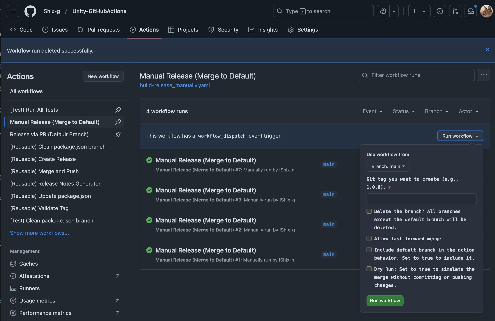
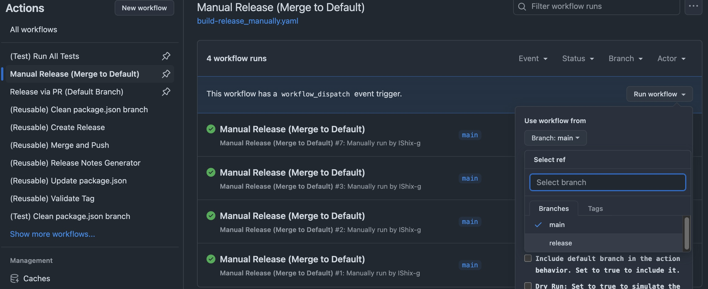

  
  
  

# Unity-GitHubActions
GitHub Actions for Unity.

## 実現すること

GitHubアクションを使った、Unityパッケージのリリース自動化  

**このアクションは以下のタスクを自動化します。**
- [パッケージマニフェスト](https://docs.unity3d.com/2022.3/Documentation/Manual/upm-manifestPkg.html)のバージョンを更新する
- リリースを生成する
- タグを作成する

### リリースノート

コミットメッセージを `feat` や `fix` といったキーワードで始めることで、自動的にリリースノートに含まれるようになります。

#### List of Available Types

| Type       | Description                |
|------------|----------------------------|
| feat:      | 新機能の追加                     |
| fix:       | バグの修正                      |
| docs:      | ドキュメントの更新や修正           |
| style:     | コードスタイルの調整(空白の削除など)  |
| refactor:  | バグ修正でも機能追加でもないコード変更 |
| perf:      | パフォーマンス向上のための変更        |

### ブランチ保護またはタグ保護が有効な場合

デフォルトではパーミッションエラーが発生します。これを回避するには、GitHub Apps でこれらの保護ルールを回避できるように設定します。

- [GitHub App](https://docs.github.com/en/apps/creating-github-apps/about-creating-github-apps/about-creating-github-apps)を作成する
- アプリをインストールし、対象のリポジトリ用に設定する
- リポジトリの Secrets に `BOT_APP_ID` と `BOT_PRIVATE_KEY` を設定する
- GitHub App が保護ルールをバイパスできるように更新する

詳しくは[GitHubApp.md](GitHubApp_jp.md)をご確認ください。

## 必須の設定

`Settings > Actions > General > Workflow permissions`で **Read and write permissions** を設定してください。

## 手動でのリリース

Actionsタブに移動し、`Manual Release (Merge to Default)` > `Run workflow`を選択して手動でリリースをおこないます。

| Option                | Description            | Default            | Example  |
|-----------------------|------------------------|--------------------|----------|
| tag| 作成したいGitタグ |                    | 1.0.0                                        |
| clean-branch | ブランチを削除しますか？デフォルトブランチ以外のすべてのブランチが削除されます | false | |
| fast-forward | マージの早送りを許可しますか？        | false              | |
| include-default-branch|デフォルト・ブランチをワークフローの動作に含める| false              ||
| dry-run | 変更をコミットまたはプッシュせずにマージをシミュレートする | false              ||
| draft-release | ドラフトリリースの場合は `true`, 非ドラフトリリースの場合は `false` | false              |

### 手動でリリースする手順

1. ブランチを作成する (例: `release`)
2. このブランチでリリースを準備する
3. `Run workflow` を使って手動リリースをトリガーする。

### セットアップガイド

1. [.github/workflows/build-release_merge.yaml](https://github.com/IShix-g/Unity-GitHubActions/blob/main/.github/workflows/build-release_merge.yaml) からコードをコピーし、プロジェクトの `.github/workflows` フォルダに YAML ファイルを作成します。
2. プロジェクト構造に合うように、`update-packagejson` 内の `file-path` を更新します。
3. ブランチ保護ルールを使用していない場合、`secrets.BOT_APP_ID` および `secrets.BOT_PRIVATE_KEY` に関する記述を削除してください。
4. 実行時にパーミッションエラーが発生した場合は、[permissions](https://docs.github.com/en/actions/writing-workflows/choosing-what-your-workflow-does/controlling-permissions-for-github_token) を構成してください。

## Release via Pull Request

任意のブランチからデフォルトブランチへのプルリクエストを作成します。**リリースタイトルにタグ名**（例: `1.0.0`）を使用する必要があります。このプルリクがマージされると、リリースが自動で作成されます。

マージ後、リリースは自動的に作成されます。

### リリース作成の条件

以下の条件が満たされた場合、リリースがトリガーされます:
- プルリクエストのタイトルにバージョン番号（例: `1.0.0`）が含まれている
- ベースブランチが[デフォルトブランチ](https://docs.github.com/en/repositories/configuring-branches-and-merges-in-your-repository/managing-branches-in-your-repository/changing-the-default-branch)である

### プルリクエストを介したリリース手順

1. ブランチを作成します（例: `release`）
2. このブランチでリリースを準備します
3. このブランチをデフォルトブランチへマージするプルリクエストを作成します。プルリクエストのタイトルにはバージョン番号を使用します
4. プルリクエストをマージします
5. リリースが自動的に生成されます

### セットアップガイド

1. [.github/workflows/build-release_pull-request.yaml](https://github.com/IShix-g/Unity-GitHubActions/blob/main/.github/workflows/build-release_pull-request.yaml) からコードをコピーし、プロジェクトの `.github/workflows` フォルダに YAML ファイルを作成します。
2. `update-packagejson` 内の `file-path` を、プロジェクトのファイル構造に合わせて更新します。
3. ブランチの保護ルールを使用していない場合、`secrets.BOT_APP_ID` および `secrets.BOT_PRIVATE_KEY` に関する記述は削除してください。
4. 実行時にパーミッションエラーが発生した場合は、[permissions](https://docs.github.com/en/actions/writing-workflows/choosing-what-your-workflow-does/controlling-permissions-for-github_token) を構成してください。

## 推奨事項

プルリクエストリリースの方法を使用している場合であっても、フォールバック手段として手動リリースオプションを構成することをお勧めします。そうしない場合、新しいプルリクエストを作成する以外にリリースを作成する手段がなくなります。

## Jobの説明

主なJobを説明します。

### タグの検証 (Validate Tag)

[.github/workflows/reusable-validate-tag.yaml](https://github.com/IShix-g/Unity-GitHubActions/blob/main/.github/workflows/reusable-validate-tag.yaml)

このアクションは、タグの形式が有効かどうかを検証し、数値のみで正規化されたタグ (`outputs.normalized-tag`) を返します。

#### 入力値 (Inputs)

| ID                       | 説明                                                                                 | デフォルト値 |
|--------------------------|--------------------------------------------------------------------------------------|------------|
| require-validation       | 無効または古いタグを禁止する場合は `true`。検証が失敗しても続行する場合は `false`。      | true       |
| validate-semantic-versioning | タグ形式を [Semantic Versioning](https://semver.org) に基づいて検証するかどうか。    | true       |
| tag                      | 検証対象のタグ (例: `1.0.0`)                                                           |            |

#### 出力値 (Outputs)

| ID               | 説明                                                             |
|------------------|-----------------------------------------------------------------|
| normalized-tag   | 正規化されたタグ (例: `v` プレフィックスなし)                      |
| tag              | 入力されたタグと同じ値                                          |
| validated        | タグが検証を通過したかを示す                                      |

---

### package.json の更新 (Update package.json)

[.github/workflows/reusable-update-packagejson.yaml](https://github.com/IShix-g/Unity-GitHubActions/blob/main/.github/workflows/reusable-update-packagejson.yaml)

このアクションは、`package.json` 内のバージョンを更新し、変更をコミットします。

#### 入力値 (Inputs)

| ID                        | 説明                                                                                | デフォルト値                      |
|---------------------------|------------------------------------------------------------------------------------|----------------------------------|
| file-path                 | 更新する`package.json` のパス。複数行のパスを指定可能で、サポートされるのは `package.json` のみです |                                   |
| tag                       | 適用する Git タグ (例: `1.0.0`)                                                     |                                   |
| dry-run                   | 実際に変更をプッシュせず、更新とコミットをシミュレートする場合は `true`                  |                                   |
| require-validation        | タグ検証が通過必須なら `true`。検証が失敗しても続行する場合は `false`                  | true                              |
| ref                       | 更新前にチェックアウトするブランチまたはタグ                                         |                                   |
| commit-message-format     | `package.json` を更新する際のコミットメッセージのテンプレート。例: `Update package.json to {v}` | `Update package.json to {v}` |

#### Secrets (機密情報)

ブランチまたはタグの保護に必要:

| ID               | 説明                              |
|-------------------|-----------------------------------|
| BOT_APP_ID        | アプリケーション ID を指定する    |
| BOT_PRIVATE_KEY   | アプリ用の秘密鍵を設定する        |

#### 出力値 (Outputs)

| ID               | 説明                                          |
|------------------|----------------------------------------------|
| normalized-tag   | 正規化されたタグ (`v` プレフィックスなしのタグ) |
| sha              | `package.json` 更新後の Git コミット SHA     |
| changed          | Git ブランチが変更または新規作成されたかどうか |

---

### マージとプッシュ (Merge and Push)

[.github/workflows/reusable-merge-and-push.yaml](https://github.com/IShix-g/Unity-GitHubActions/blob/main/.github/workflows/reusable-merge-and-push.yaml)

このアクションは、ブランチをマージして変更をプッシュします。

#### 入力値 (Inputs)

| ID              | 説明                                            | デフォルト値 |
|-----------------|------------------------------------------------|------------|
| target-branch   | リポジトリからマージする対象のブランチ              |            |
| push-branch     | 変更をプッシュする対象ブランチ                   |            |
| commit-id       | リリースやタグ作成用のコミット ID                |            |
| dry-run         | 実際にコミットせずシミュレーションする場合は `true`    | false      |
| fast-forward    | ファストフォワードマージを許可する場合は `true`      | false      |

#### Secrets (機密情報)

ブランチまたはタグの保護に必要:

| ID               | 説明                              |
|-------------------|-----------------------------------|
| BOT_APP_ID        | アプリケーション ID を指定する    |
| BOT_PRIVATE_KEY   | アプリ用の秘密鍵を設定する        |

#### 出力値 (Outputs)

| ID               | 説明                                     |
|------------------|-----------------------------------------|
| sha              | マージ後の Git コミット SHA             |
| merged           | ブランチが正常にマージされたかどうか      |

---

### リリースノート生成 (Release Notes Generator)

[.github/workflows/reusable-release-notes.yaml](https://github.com/IShix-g/Unity-GitHubActions/blob/main/.github/workflows/reusable-release-notes.yaml)

このアクションは、コミットメッセージに基づいてリリースノートを生成します。`fix:` または `feat:` で始まるメッセージがリリースノートに含まれます。

#### 入力値 (Inputs)

| ID                     | 説明                                                                             | デフォルト値           |
|------------------------|---------------------------------------------------------------------------------|-----------------------|
| from-tag               | 開始タグ (未設定の場合は最初のコミットがデフォルト)                               |                       |
| to-tag                 | 終了タグ (未設定の場合は最新コミットがデフォルト)                                |                       |
| commit-message-format  | コミットメッセージの形式 (詳細は [pretty-formats](https://git-scm.com/docs/pretty-formats) を参照)。 | `- %s (%h)`           |
| commit-id              | リリースやタグ作成用のコミット ID                                               |                       |
| derive-from-tag        | 前回のタグを基に`from-tag`を自動決定する場合は `true`。手動設定の場合は `false`      | true                  |

#### 出力値 (Outputs)

| ID      | 説明                             |
|---------|---------------------------------|
| notes   | 生成されたリリースノート         |

---

### リリース作成 (Create Release)

[.github/workflows/reusable-create-release.yaml](https://github.com/IShix-g/Unity-GitHubActions/blob/main/.github/workflows/reusable-create-release.yaml)

このアクションは、リリースを作成し、必要に応じてタグを追加します。

#### 入力値 (Inputs)

| ID                     | 説明                                                                         | デフォルト値      |
|------------------------|-----------------------------------------------------------------------------|-----------------|
| commit-id              | リリースおよびタグ作成用のコミット ID                                        |                 |
| dry-run                | シミュレーションのみにする場合は `true` (リリースは作成されません)                  |                 |
| require-validation     | 検証が必須の場合は `true`、スキップする場合は `false`                          | true            |
| wait-before-delete     | 一時的なブランチを削除する前の待機時間 (秒単位)                                  | 25              |
| tag                    | 作成する Git タグ (例: `1.0.0`)                                              |                 |
| release-format         | リリースタイトルのテンプレート (例: `Ver.{0}` は `Ver.1.0.0` のように設定されます)  | Ver.{0}         |
| release-note           | 含めたいカスタムリリースノート                                              |                 |
| draft-release          | 下書きリリースの場合は `true`、最終リリースの場合は `false`                      | false           |

#### Secrets (機密情報)

ブランチまたはタグの保護に必要:

| ID               | 説明                              |
|-------------------|-----------------------------------|
| BOT_APP_ID        | アプリケーション ID を指定する    |
| BOT_PRIVATE_KEY   | アプリ用の秘密鍵を設定する        |

## 参考リポジトリ

以下のリポジトリを参考にしました。

[https://github.com/Cysharp/Actions](https://github.com/Cysharp/Actions)