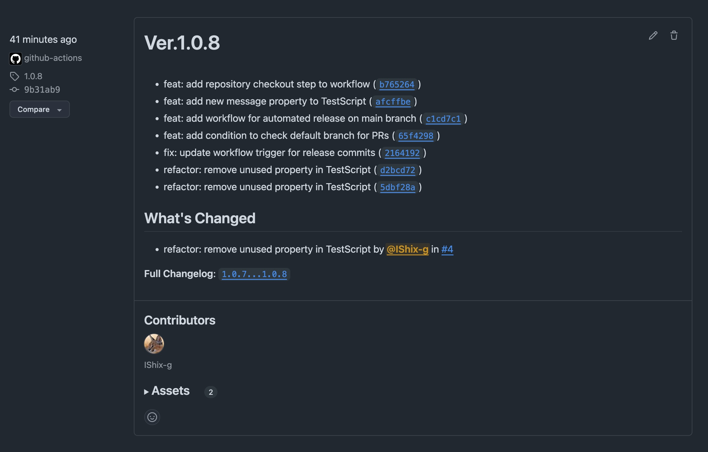
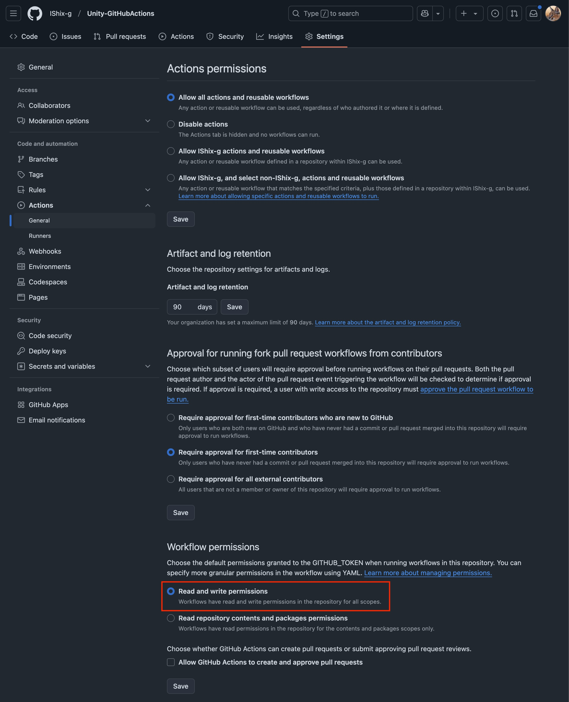
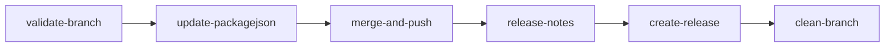
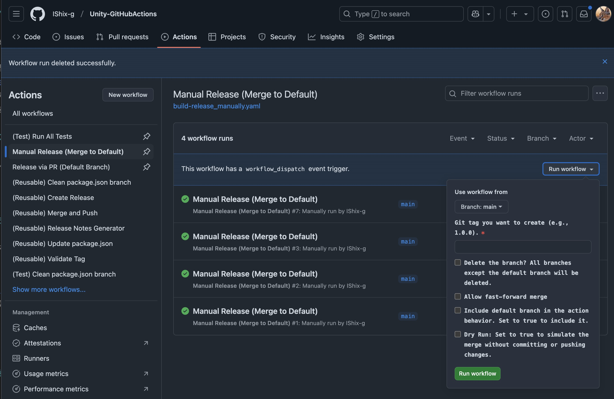
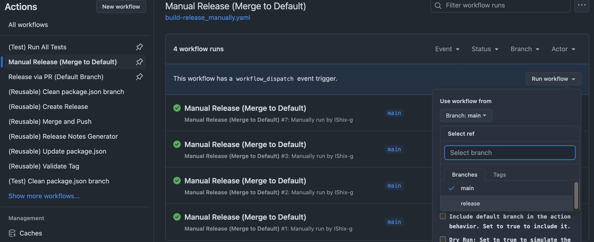
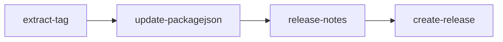
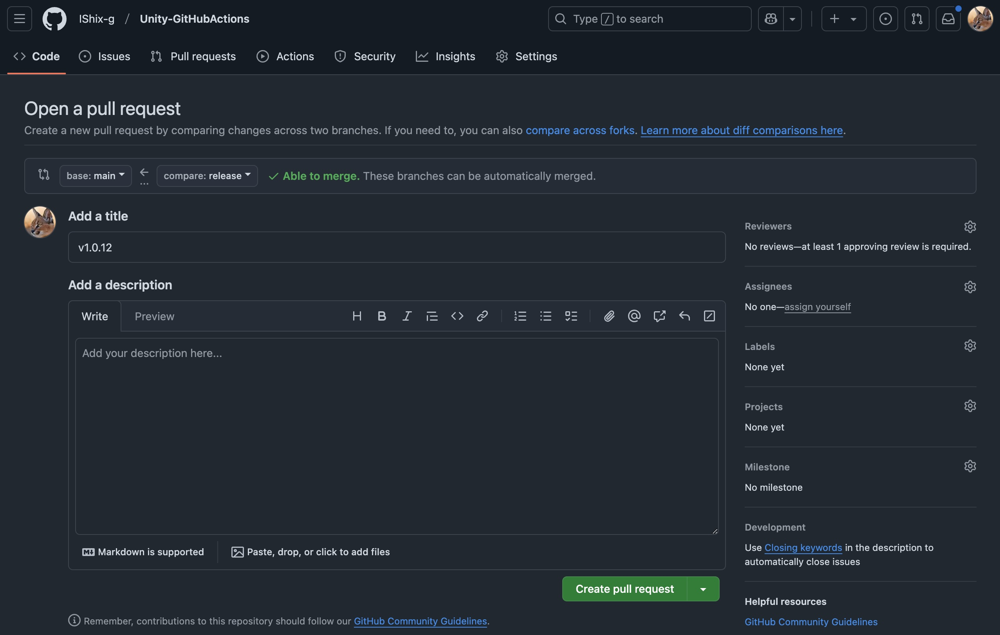
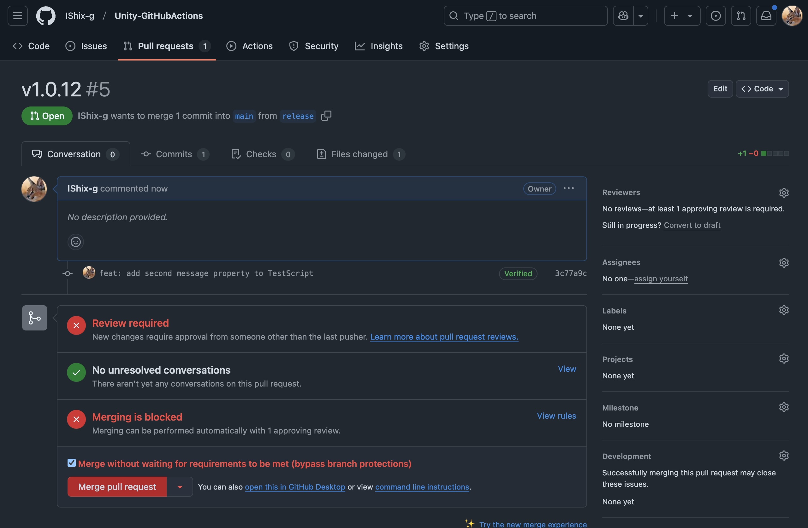
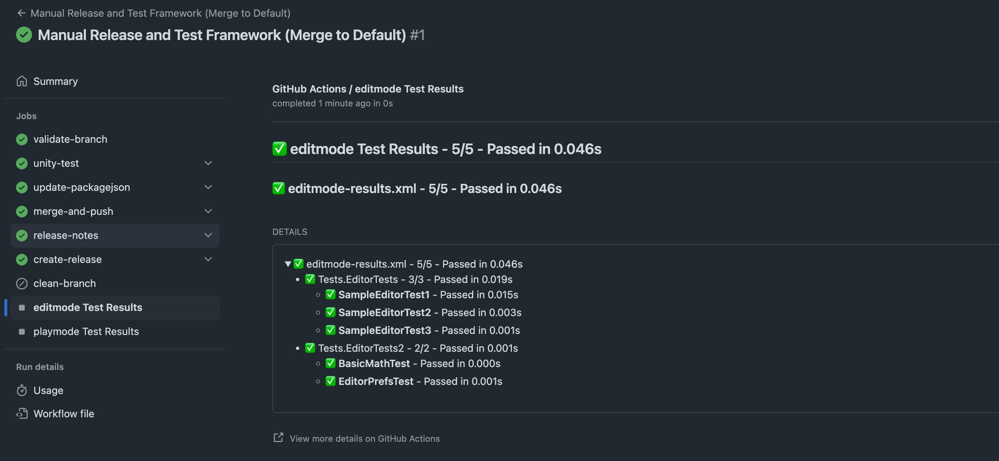
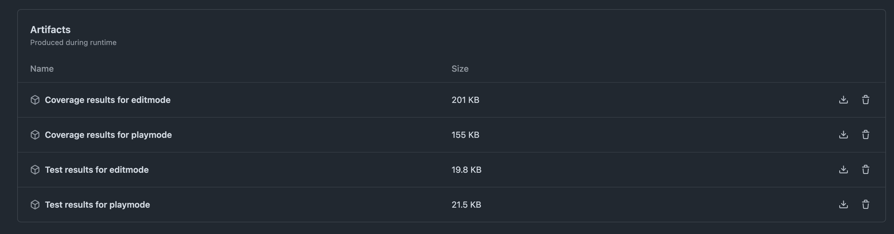

[](https://github.com/IShix-g/Unity-GitHubActions/actions/workflows/test-create-release.yaml)  
[](https://github.com/IShix-g/Unity-GitHubActions/actions/workflows/test-update-packagejson.yaml)  
[](https://github.com/IShix-g/Unity-GitHubActions/actions/workflows/test-merge-and-push.yaml)  
[](https://github.com/IShix-g/Unity-GitHubActions/actions/workflows/test-release-notes.yaml)  
[](https://github.com/IShix-g/Unity-GitHubActions/actions/workflows/test-build-package.yaml)  
[](https://github.com/IShix-g/Unity-GitHubActions/actions/workflows/test-unity-test.yaml)

[README - 日本語版](Docs/README_jp.md)

# Unity-GitHubActions
GitHub Actions for Unity.

## Table of Contents

<!-- START doctoc generated TOC please keep comment here to allow auto update -->
<!-- DON'T EDIT THIS SECTION, INSTEAD RE-RUN doctoc TO UPDATE -->
<details>
<summary>Details</summary>

- [Overview](#overview)
  - [Release Notes](#release-notes)
    - [Available Commit Message Types](#available-commit-message-types)
- [Required Settings](#required-settings)
- [Settings for Different Scenarios](#settings-for-different-scenarios)
  - [When Branch Protection or Tag Protection is Enabled](#when-branch-protection-or-tag-protection-is-enabled)
  - [When Running Tests or Generating Packages](#when-running-tests-or-generating-packages)
  - [Required Secrets](#required-secrets)
- [Is Building Unity Packages Necessary?](#is-building-unity-packages-necessary)
- [Manual Release](#manual-release)
  - [Steps for Manual Release](#steps-for-manual-release)
  - [Setup Guide](#setup-guide)
- [Release Through Pull Requests](#release-through-pull-requests)
  - [Release Creation Conditions](#release-creation-conditions)
  - [Steps for PR-Based Release](#steps-for-pr-based-release)
  - [Setup Guide](#setup-guide-1)
- [Recommendations](#recommendations)
- [Adding Unity Test Framework (formerly Test Runner)](#adding-unity-test-framework-formerly-test-runner)
  - [About Tests](#about-tests)
  - [Workflow Examples](#workflow-examples)
  - [Adding to Existing Workflow](#adding-to-existing-workflow)
  - [Specifying Test Mode](#specifying-test-mode)
    - [Code Example (Default Setting)](#code-example-default-setting)
    - [Sample Execution Result](#sample-execution-result)
- [Adding Package Generation](#adding-package-generation)
  - [About Package Generation](#about-package-generation)
  - [&#91;Note&#93; Environments That Cannot Generate Packages](#note-environments-that-cannot-generate-packages)
    - [Path Examples](#path-examples)
  - [Adding to Existing Workflow](#adding-to-existing-workflow-1)
  - [Required Unity Editor Settings](#required-unity-editor-settings)
  - [Sample Execution Result](#sample-execution-result-1)
- [PackageExporter](#packageexporter)
  - [Installation](#installation)
    - [&#91;Recommended&#93; Package Manager](#recommended-package-manager)
    - [Download the Package](#download-the-package)
  - [&#91;Required&#93; Running Export Tests](#required-running-export-tests)
- [About GitHub Actions Usage Fees](#about-github-actions-usage-fees)
- [Job Descriptions](#job-descriptions)
  - [Validate Tag](#validate-tag)
    - [Inputs](#inputs)
    - [Outputs](#outputs)
  - [Update package.json](#update-packagejson)
    - [Inputs](#inputs-1)
    - [Secrets](#secrets)
    - [Outputs](#outputs-1)
  - [Merge and Push](#merge-and-push)
    - [Inputs](#inputs-2)
    - [Secrets](#secrets-1)
    - [Outputs](#outputs-2)
  - [Release Notes Generator](#release-notes-generator)
    - [Inputs](#inputs-3)
    - [Outputs](#outputs-3)
  - [Create Release](#create-release)
    - [Inputs](#inputs-4)
    - [Secrets](#secrets-2)
  - [Running Unity Tests (Unity Test Framework)](#running-unity-tests-unity-test-framework)
    - [About This Workflow](#about-this-workflow)
    - [Inputs](#inputs-5)
    - [Secrets](#secrets-3)
  - [Generating a Package (Build Package)](#generating-a-package-build-package)
    - [Inputs](#inputs-6)
    - [Outputs](#outputs-4)
    - [Secrets](#secrets-4)
  - [Uploading a Package to Release](#uploading-a-package-to-release)
    - [Inputs](#inputs-7)
      - [Generating the SHA-256 Hash](#generating-the-sha-256-hash)
- [Referenced Repository](#referenced-repository)

</details>
<!-- END doctoc generated TOC please keep comment here to allow auto update -->

## Overview

This repository provides automation for Unity package releases using GitHub Actions.

**This action automates the following tasks:**

- Update the [package manifest](https://docs.unity3d.com/2022.3/Documentation/Manual/upm-manifestPkg.html) version
- Generate releases
- Create tags
- Run tests using the [Unity Test Framework (formerly Test Runner)](https://docs.unity3d.com/2022.3/Documentation/Manual/testing-editortestsrunner.html)
- Build [packages](https://docs.unity3d.com/2022.3/Documentation/Manual/CustomPackages.html)
- Upload the [packages](https://docs.unity3d.com/2022.3/Documentation/Manual/CustomPackages.html) to the release page

You can choose to execute only specific tasks you need.

### Release Notes

When commit messages start with specific keywords like `feat` or `fix`, they will be automatically included in the release notes.

#### Available Commit Message Types

| Type       | Description                              |
|------------|------------------------------------------|
| feat:      | Add new features                         |
| fix:       | Fix bugs                                 |
| docs:      | Update or fix documentation              |
| style:     | Code style fixes (e.g., remove whitespaces) |
| refactor:  | Refactor without changing functionality  |
| perf:      | Changes to improve performance           |



## Required Settings

Set **Read and write permissions** for `Settings > Actions > General > Workflow permissions`.



## Settings for Different Scenarios

### When Branch Protection or Tag Protection is Enabled

By default, permission errors will occur. You need to configure GitHub Apps to bypass these protection rules.

1. Create a [GitHub App](https://docs.github.com/en/apps/creating-github-apps/about-creating-github-apps/about-creating-github-apps)
2. Install the app and configure it for your repository.
3. Add `BOT_APP_ID` and `BOT_PRIVATE_KEY` to the repository's secrets.
4. Update the app permissions so it can bypass protection rules.

For more details, refer to [GitHubApp.md](GitHubApp_jp.md).

### When Running Tests or Generating Packages

Unity needs to be executed in batch mode, which requires Unity account information.  
Refer to [Activation](https://game.ci/docs/github/activation) for the necessary details and configure them in your repository.  
Tests and package generation utilize [GameCI](https://game.ci/docs/github/builder).

### Required Secrets

Depending on your Unity license, either `UNITY_LICENSE` for Personal or `UNITY_SERIAL` for Pro is mandatory. Add these to the repository's secrets.

| Name           | Description                                |
|----------------|--------------------------------------------|
| UNITY_EMAIL    | Email address for Unity login              |
| UNITY_PASSWORD | Password for Unity login                   |
| UNITY_LICENSE  | Required for Personal license              |
| UNITY_SERIAL   | Required for Pro license                   |

## Is Building Unity Packages Necessary?

Since Unity 2018, it has been possible to manage packages via the [Package Manager (UPM)](https://docs.unity3d.com/2022.3/Documentation/Manual/Packages.html), and now almost all supported Unity versions are compatible with UPM. Because of this, the traditional process of generating Unity packages has become largely unnecessary. As a result, the main workflow we provide does not include the release of Unity packages.

## Manual Release

[build-release_merge.yaml](https://github.com/IShix-g/Unity-GitHubActions/blob/main/.github/workflows/build-release_merge.yaml)



For manual releases:
1. Navigate to the Actions tab.
2. Select `Manual Release (Merge to Default)` > `Run workflow`.

[Sample Workflow Execution](https://github.com/IShix-g/Unity-GitHubActions/actions/runs/13129242127)



| Option                  | Description                                            | Default | Example         |
|-------------------------|--------------------------------------------------------|---------|-----------------|
| tag                    | Git tag to create                                      | N/A     | 1.0.0           |
| clean-branch           | Whether to delete non-default branches                 | false   |                 |
| fast-forward           | Whether to allow [fast-forward](https://docs.github.com/en/enterprise-cloud@latest/repositories/configuring-branches-and-merges-in-your-repository/configuring-pull-request-merges/about-merge-methods-on-github#rebasing-and-merging-your-commits) merging                  | false   |                 |
| include-default-branch | Whether to include the default branch in the workflow  | false   |                 |
| dry-run                | Simulate without committing or pushing changes         | false   |                 |
| draft-release          | Set to `true` for a draft release, `false` for final   | false   |                 |

### Steps for Manual Release

1. Create a new branch (e.g., `release`).
2. Prepare the release in this branch.
3. Trigger a manual release using `Run workflow`.



### Setup Guide

1. Copy the code from [.github/workflows/build-release_merge.yaml](https://github.com/IShix-g/Unity-GitHubActions/blob/main/.github/workflows/build-release_merge.yaml) to a new YAML file in your project's `.github/workflows` directory.
2. Update the `file-path` in `update-packagejson` to match your project structure.
3. If not using branch protection rules, remove references to `secrets.BOT_APP_ID` and `secrets.BOT_PRIVATE_KEY`.

**Note:** In case of permission errors during execution, configure proper [permissions](https://docs.github.com/en/actions/writing-workflows/choosing-what-your-workflow-does/controlling-permissions-for-github_token).

## Release Through Pull Requests

[build-release_pull-request.yaml](https://github.com/IShix-g/Unity-GitHubActions/blob/main/.github/workflows/build-release_pull-request.yaml)



Create a pull request from any branch to the default branch. **Ensure the release title matches the tag name (e.g., `1.0.0`).** The release will be created automatically after merging the pull request.

[Sample Execution](https://github.com/IShix-g/Unity-GitHubActions/actions/runs/13323524820)



Releases are created automatically post-merge.



### Release Creation Conditions

A release will be created if:
- The pull request title includes a version number (e.g., `1.0.0`).
- The base branch is the [default branch](https://docs.github.com/en/repositories/configuring-branches-and-merges-in-your-repository/managing-branches-in-your-repository/changing-the-default-branch).

### Steps for PR-Based Release

1. Create a branch (e.g., `release`).
2. Prepare the release in this branch.
3. Create a pull request from this branch to the default branch with the title set to the version (e.g., `v1.0.0`).
4. Merge the pull request.
5. The release will be generated automatically.

### Setup Guide

1. Copy the code from [.github/workflows/build-release_pull-request.yaml](https://github.com/IShix-g/Unity-GitHubActions/blob/main/.github/workflows/build-release_pull-request.yaml) to a YAML file in your `.github/workflows` directory.
2. Update the `file-path` in `update-packagejson` to match your project structure.
3. If not using branch protection rules, remove references to `secrets.BOT_APP_ID` and `secrets.BOT_PRIVATE_KEY`.

## Recommendations

Even if you primarily use the pull-request-based release method, it is recommended to configure manual release as a fallback.


## Adding Unity Test Framework (formerly Test Runner)

Execute tests within Unity Editor. Configuration is required to use this feature. Please refer to the [Setup](#when-running-tests-or-generating-packages) section.

### About Tests

Tests are executed using GameCI's [Test Runner](https://game.ci/docs/github/test-runner).  
There’s no need to specify individual tests; it will automatically run Edit Tests and/or Play Tests created in UnityEditor.

### Workflow Examples

Please refer to [build-release_merge_test.yaml](https://github.com/IShix-g/Unity-GitHubActions/blob/main/.github/workflows/build-release_merge_test.yaml) as an example implementation.

### Adding to Existing Workflow

- Add `checks: write` to `permissions`
- Add a `unity-test` job
- Specify the Unity Editor version in `unity-version` (e.g., `2021.3.45f1`)

Supported Unity Editor versions can be checked [here](https://game.ci/docs/docker/versions).

### Specifying Test Mode

By default, both Edit Mode and Play Mode tests are executed.  
If you want to run only specific modes, specify the `test-modes` parameter. Valid parameters can be found in [Game CI - testMode](https://game.ci/docs/github/test-runner/#testmode).  
To specify multiple modes, separate them with commas.

#### Code Example (Default Setting)
```yaml
test-modes: 'playmode,editmode'
```

#### Sample Execution Result

You can view the list of executed tests.  
[Sample Execution Result](https://github.com/IShix-g/Unity-GitHubActions/actions/runs/13325816869)  


[Unity - Code Coverage](https://docs.unity3d.com/Packages/com.unity.testtools.codecoverage@1.2/manual/index.html) will be included in the artifacts.



## Adding Package Generation

Refer to [build-release_merge_package.yaml](https://github.com/IShix-g/Unity-GitHubActions/blob/main/.github/workflows/build-release_merge_package.yaml) for implementation details. Configuration is required, as explained in the [Setup](#when-running-tests-or-generating-packages) section.  
This process allows you to:

- Generate packages ([UPM package](https://docs.unity3d.com/2022.3/Documentation/Manual/upm-ui-install.html))
- Attach the generated package to the assets section of the release page

### About Package Generation

The package generation uses GameCI's [Builder](https://game.ci/docs/github/builder).

### [Note] Environments That Cannot Generate Packages

Packages cannot be generated if the package path is outside the `Assets` folder in Unity Editor.

#### Path Examples

- [Works] `Assets/MyPackage/`
- [Fails] `Packages/MyPackage/`

### Adding to Existing Workflow

- Add a `build-package` job
- Specify the package name without the extension in `package-name` (e.g., `TestPackage`)
- Specify the Unity Editor version in `unity-version` (e.g., `2021.3.45f1`)
- Add a `release-package-upload` job

Supported Unity Editor versions can be checked [here](https://game.ci/docs/docker/versions).

### Required Unity Editor Settings

A script for generating packages is required. Please use the provided [PackageExporter](#packageexporter).

### Sample Execution Result

The built package will appear in the release.  
[Sample Execution Result](https://github.com/IShix-g/Unity-GitHubActions/actions/runs/13320955403)  


## PackageExporter

This script generates packages. It is lightweight and only functional in the Editor, with no additions to build outputs.

### Installation
Install it using one of the following methods:

#### [Recommended] Package Manager

Open Unity Editor, and go to "Window > Package Manager > Add package from git URL...". Enter the following URL to install:

URL: `https://github.com/IShix-g/Unity-GitHubActions.git?path=Assets/PackageExporter`

#### Download the Package

Download the package from the `Assets` section of the [release page](https://github.com/IShix-g/Unity-GitHubActions/releases) as `PackageExporter_xxx.unitypackage`, and install it.

### [Required] Running Export Tests

- Open "Window > Test Export Package" in Unity Editor
- Enter the necessary information and run the export
- If no errors appear in the console and the path of the exported package is displayed, the process is successful

Install the exported package in a test project to verify its functionality.

## About GitHub Actions Usage Fees

When using GitHub Actions in a private repository, usage fees apply. For public repositories, it remains free.  
While fees are incurred, there is a free usage allowance available. You can check the details via [Billing and plans > Plans and usage > Usage this month](https://github.com/settings/billing/summary).

## Job Descriptions

Main Job Descriptions.

### Validate Tag

[.github/workflows/reusable-validate-tag.yaml](https://github.com/IShix-g/Unity-GitHubActions/blob/main/.github/workflows/reusable-validate-tag.yaml)

This action checks if the tag format is valid and returns `outputs.normalized-tag`, a normalized version of the tag with only numeric values.

#### Inputs

| id                        | description                                                                                                             | default |
|---------------------------|-------------------------------------------------------------------------------------------------------------------------|---------|
| require-validation        | `true` to disallow old or invalid tags. `false` to proceed even if validation fails.                                    | true    |
| validate-semantic-versioning | Specifies whether to validate the tag format using Semantic Versioning.                                              | true    |
| tag                       | The tag to validate (e.g., `1.0.0`).                                                                                   |         |

#### Outputs

| id               | description                                                                 |
|------------------|-----------------------------------------------------------------------------|
| normalized-tag   | Normalized tag (e.g., tag without the `v` prefix).                         |
| tag              | Same as the input tag.                                                     |
| validated        | Indicates whether the tag passed validation.                               |

---

### Update package.json

[.github/workflows/reusable-update-packagejson.yaml](https://github.com/IShix-g/Unity-GitHubActions/blob/main/.github/workflows/reusable-update-packagejson.yaml)

This action updates the version in `package.json` and commits the changes.

#### Inputs

| id                        | description                                                                                            | default              |
|---------------------------|--------------------------------------------------------------------------------------------------------|----------------------|
| file-path                 | Path to the `package.json` file to update. You can provide multiline paths. Only `package.json` files are supported. |                      |
| tag                       | The Git tag to assign (e.g., `1.0.0`).                                                                |                      |
| dry-run                   | `true` to simulate the update and commit without actual changes being pushed.                         |                      |
| require-validation        | `true` requires tag validation to pass, `false` allows proceeding even if it fails.                   | true                 |
| ref                       | The branch or tag to check out before updating.                                                       |                      |
| commit-message-format     | Template for the commit message when updating `package.json`. Example: `Update package.json to {v}`. | `Update package.json to {v}` |

#### Secrets

For branch or tag protection:

| id            | description                |
|---------------|----------------------------|
| BOT_APP_ID    | Specify the application ID |
| BOT_PRIVATE_KEY | Set the private key for the app |

#### Outputs

| id               | description                                      |
|------------------|--------------------------------------------------|
| normalized-tag   | Normalized tag (tag without the `v` prefix).     |
| sha              | Git commit SHA after the `package.json` update. |
| changed          | Indicates if the Git branch was modified or created. |

---

### Merge and Push

[.github/workflows/reusable-merge-and-push.yaml](https://github.com/IShix-g/Unity-GitHubActions/blob/main/.github/workflows/reusable-merge-and-push.yaml)

This action merges branches and pushes the changes.

#### Inputs

| id             | description                                     | default |
|----------------|-------------------------------------------------|---------|
| target-branch  | The target branch from the repository to merge. |         |
| push-branch    | The branch to push the changes into.            |         |
| commit-id      | Commit ID for creating a release and tag.       |         |
| dry-run        | Enables dry-run mode (simulate without committing). | false   |
| fast-forward   | Allows a fast-forward merge.                   | false   |

#### Secrets

For branch or tag protection:

| id              | description                |
|-----------------|----------------------------|
| BOT_APP_ID      | Specify the application ID |
| BOT_PRIVATE_KEY | Set the private key for the app |

#### Outputs

| id               | description                                   |
|------------------|-----------------------------------------------|
| sha              | Git commit SHA after the merge.              |
| merged           | Indicates if the branches were successfully merged. |

---

### Release Notes Generator

[.github/workflows/reusable-release-notes.yaml](https://github.com/IShix-g/Unity-GitHubActions/blob/main/.github/workflows/reusable-release-notes.yaml)

This action generates release notes based on commit messages. Messages beginning with `fix:` or `feat:` will be included in the release notes.

#### Inputs

| id                     | description                                                                              | default                  |
|------------------------|------------------------------------------------------------------------------------------|--------------------------|
| from-tag               | The starting tag (default: first commit if unset).                                       |                          |
| to-tag                 | The ending tag (default: latest commit if unset).                                        |                          |
| commit-message-format  | Format for commit messages (see https://git-scm.com/docs/pretty-formats for details).    | `- %s (%h)`              |
| commit-id              | Commit ID for release and tag.                                                          |                          |
| derive-from-tag        | `true` to auto-determine `from-tag` using previous tags; `false` to configure manually. | true                     |

#### Outputs

| id      | description                           |
|---------|---------------------------------------|
| notes   | The generated release notes.         |

---

### Create Release

[.github/workflows/reusable-create-release.yaml](https://github.com/IShix-g/Unity-GitHubActions/blob/main/.github/workflows/reusable-create-release.yaml)

This action creates a release and optionally adds a tag.

#### Inputs

| id                     | description                                                                                       | default        |
|------------------------|---------------------------------------------------------------------------------------------------|----------------|
| commit-id              | Commit ID for creating the release and tag.                                                      |                |
| dry-run                | `true` to perform a dry run (does not create the release).                                        |                |
| require-validation     | `true` enforces validation; `false` skips validation and proceeds.                                | true           |
| wait-before-delete     | The wait time (in seconds) before deleting temporary branches.                                    | 25             |
| tag                    | The Git tag to create (e.g., `1.0.0`).                                                           |                |
| release-format         | Template for the release title. E.g., `Ver.{0}` will title the release as `Ver.1.0.0`. `{0}` omits prefixes. | Ver.{0}        |
| release-note           | Custom release notes to include.                                                                 |                |
| draft-release          | `true` for a draft release; `false` for a final release.                                         | false          |

#### Secrets

For branch or tag protection:

| id              | description                |
|-----------------|----------------------------|
| BOT_APP_ID      | Specify the application ID |
| BOT_PRIVATE_KEY | Set the private key for the app |

---

### Running Unity Tests (Unity Test Framework)

[.github/workflows/reusable-unity-test.yaml](https://github.com/IShix-g/Unity-GitHubActions/blob/main/.github/workflows/reusable-unity-test.yaml)

#### About This Workflow

- Executes either Edit Tests, Play Tests, or both using Unity Editor
- Test results can be viewed under the [Sample Execution Result](https://github.com/IShix-g/Unity-GitHubActions/actions/runs/13325816869)
- Requires [setup](#when-running-tests-or-generating-packages) to be completed

※ This workflow uses GameCI's [Test Runner](https://game.ci/docs/github/test-runner) to execute tests.

#### Inputs

| ID              | Description                                                                 | Default Value                   |
|------------------|-----------------------------------------------------------------------------|---------------------------------|
| unity-version    | Specifies the Unity version. If set to `auto`, the project's Unity version is used | auto                            |
| project-path     | Specifies the path to the Unity project                                    |                                 |
| test-modes       | Specifies [which tests](https://game.ci/docs/github/test-runner/#testmode) to run  | playmode,editmode               |
| coverage-options | Sets options for [code coverage](https://game.ci/docs/github/test-runner#coverageoptions) | generateAdditionalMetrics;generateHtmlReport;generateBadgeReport |

Check supported Unity versions [here](https://game.ci/docs/docker/versions).

#### Secrets

The following secrets are required to execute Unity Editor in batch mode:

| ID              | Description                                                    |
|------------------|----------------------------------------------------------------|
| UNITY_EMAIL      | Email address to log in to Unity                              |
| UNITY_PASSWORD   | Password to log in to Unity                                   |
| UNITY_LICENSE    | Required if using a Personal license                          |
| UNITY_SERIAL     | Required if using a Pro license                               |

For more details, please refer to the [setup section](#when-running-tests-or-generating-packages).

---

### Generating a Package (Build Package)

[.github/workflows/reusable-build-package.yaml](https://github.com/IShix-g/Unity-GitHubActions/blob/main/.github/workflows/reusable-build-package.yaml)

- Executes the package build
- Packages must be located under the `Assets` directory
- Requires the installation of [PackageExporter](#packageexporter)
- Requires [setup](#when-running-tests-or-generating-packages) to be completed

※ This workflow uses GameCI's [Builder](https://game.ci/docs/github/builder) to generate packages.

#### Inputs

| ID              | Description                                                    | Default Value                   |
|------------------|----------------------------------------------------------------|---------------------------------|
| tag             | The Git tag to apply (e.g., `1.0.0`)                           |                                 |
| package-name    | Specifies the package name without the extension (e.g., `TestPackage`) |                                 |
| commit-id       | Commit ID for creating releases or tags                        |                                 |
| unity-version    | Specifies the Unity version. If set to `auto`, the project's Unity version is used | auto                            |
| project-path     | Specifies the path to the Unity project                       |                                 |
| build-method    | Name of the script method to build the package, including the namespace | PackageExporter.Editor.CLIBuilder.Build |
| retention-days  | Specifies how long the [artifact is retained](https://github.com/actions/upload-artifact?tab=readme-ov-file#usage) | 0                              |

Check supported Unity versions [here](https://game.ci/docs/docker/versions).  
If uploading generated packages to the release page, setting `retention-days` to 1 day is sufficient.

#### Outputs

| ID              | Description                                                    |
|------------------|----------------------------------------------------------------|
| package-name     | The specified package name                                    |
| export-path      | Output path of the generated package                          |
| artifact-url     | Download URL of the generated package                         |
| package-hash     | SHA-256 hash of the generated package                         |

※ `export-path` is for verification purposes. Due to GitHub Actions' limitations, it will be deleted after the workflow is completed.

#### Secrets

The following secrets are required to execute Unity Editor in batch mode:

| ID              | Description                                                    |
|------------------|----------------------------------------------------------------|
| UNITY_EMAIL      | Email address to log in to Unity                              |
| UNITY_PASSWORD   | Password to log in to Unity                                   |
| UNITY_LICENSE    | Required if using a Personal license                          |
| UNITY_SERIAL     | Required if using a Pro license                               |

For more details, please refer to the [setup section](#when-running-tests-or-generating-packages).

---

### Uploading a Package to Release

[.github/workflows/reusable-release-package-upload.yaml](https://github.com/IShix-g/Unity-GitHubActions/blob/main/.github/workflows/reusable-release-package-upload.yaml)

This action uploads a package to the release page.

#### Inputs

| ID                     | Description                                                               | Default Value |
|-------------------------|---------------------------------------------------------------------------|---------------|
| release-tag            | Tag of the release to upload the package to (e.g., `1.0.0`)              |               |
| artifact-package-name  | Name of the uploaded artifact package (e.g., `TestPackage_1.0.0.unitypackage`) |               |
| package-hash           | SHA-256 hash of the target package                                       |               |
| dry-run                | Set to `true` if only testing; no upload will occur                      | false         |

##### Generating the SHA-256 Hash

If generating the SHA-256 hash yourself, follow the example below:  
Note that the [artifact-digest](https://github.com/actions/upload-artifact#outputs) produced during artifact upload is also a SHA-256 hash but cannot be reused here.

```yaml
hash=$(sha256sum "$package_path" | awk '{ print $1 }')
```

## Referenced Repository

This repository served as a reference or inspiration for the workflows and configurations described above.

https://github.com/Cysharp/Actions