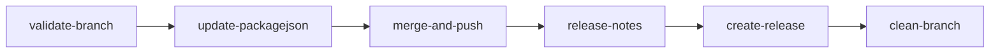
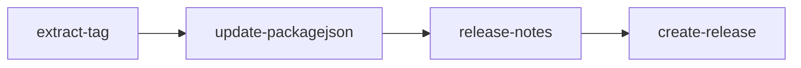

  
  
  

[README - 日本語版](Docs/README_jp.md)

# Unity-GitHubActions
GitHub Actions for Unity.

## Table of Contents

<!-- START doctoc generated TOC please keep comment here to allow auto update -->
<!-- DON'T EDIT THIS SECTION, INSTEAD RE-RUN doctoc TO UPDATE -->

Details

- [What does this action do?](#what-does-this-action-do)
  - [Release Notes](#release-notes)
    - [List of Available Types](#list-of-available-types)
  - [When branch or tag protection is enabled](#when-branch-or-tag-protection-is-enabled)
- [Required Configuration](#required-configuration)
- [Manual Release](#manual-release)
  - [Steps to Release Manually](#steps-to-release-manually)
  - [Setup Guide](#setup-guide)
- [Release via Pull Request](#release-via-pull-request)
  - [Conditions for Release Creation](#conditions-for-release-creation)
  - [Steps to Release via Pull Request](#steps-to-release-via-pull-request)
  - [Setup Guide](#setup-guide-1)
- [Recommendation](#recommendation)
- [Job Descriptions](#job-descriptions)
  - [Validate Tag](#validate-tag)
    - [Inputs](#inputs)
    - [Outputs](#outputs)
  - [Update package.json](#update-packagejson)
    - [Inputs](#inputs-1)
    - [Secrets](#secrets)
    - [Outputs](#outputs-1)
  - [Merge and Push](#merge-and-push)
    - [Inputs](#inputs-2)
    - [Secrets](#secrets-1)
    - [Outputs](#outputs-2)
  - [Release Notes Generator](#release-notes-generator)
    - [Inputs](#inputs-3)
    - [Outputs](#outputs-3)
  - [Create Release](#create-release)
    - [Inputs](#inputs-4)
    - [Secrets](#secrets-2)
- [Referenced Repository](#referenced-repository)

<!-- END doctoc generated TOC please keep comment here to allow auto update -->

## What does this action do?

Automate Unity Package Releases Using GitHub Actions

**This action automates the following tasks:**
- Updates the version in the [Package manifest](https://docs.unity3d.com/2022.3/Documentation/Manual/upm-manifestPkg.html)
- Generates a release
- Creates tags

### Release Notes

By starting commit messages with keywords like `feat` or `fix`, they will be automatically included in the release notes.

#### List of Available Types

| Type       | Description                                          |
|------------|------------------------------------------------------|
| feat:      | Addition of a new feature                           |
| fix:       | Bug fixes                                           |
| docs:      | Documentation updates or corrections                |
| style:     | Code style adjustments (e.g., removing whitespaces) |
| refactor:  | Code changes that neither fix a bug nor add a feature |
| perf:      | Changes made to improve performance                 |

### When branch or tag protection is enabled

**If branch or tag protection is enabled**, a permission error will occur by default. To bypass this, you can configure GitHub Apps to allow bypassing those protection rules.

- Create a [GitHub App](https://docs.github.com/en/apps/creating-github-apps/about-creating-github-apps/about-creating-github-apps)
- Install the app and configure it for the target repository
- Set `BOT_APP_ID` and `BOT_PRIVATE_KEY` in the repository's Secrets
- Update the protection rules to allow the GitHub App to bypass them

For detailed configuration instructions, please refer to [GitHubApp.md](Docs/GitHubApp.md).

## Required Configuration

Enable the **Read and write permissions** setting under `Settings > Actions > General > Workflow permissions`.

## Manual Release

Navigate to the Actions tab and trigger the manual release by selecting `Run workflow`.

| Option                | Description  | Default | Example  |
|-----------------------|--------------|---------|----------|
| tag                  | Git tag you want to create  |         | 1.0.0    |
| clean-branch         | Delete the branch? All branches except the default branch will be deleted.  | false   |          |
| fast-forward         | Allow fast-forward merge   | false   |          |
| include-default-branch | Include the default branch in the workflow behavior | false   |          |
| dry-run              | Simulate the merge without committing or pushing changes | false   |          |
| draft-release        | `true` for Draft release, `false` for Non-draft release | false   |          |

### Steps to Release Manually

1. Create a branch (e.g., `release`)
2. Prepare the release in this branch
3. Trigger the manual release via `Run workflow`

### Setup Guide

1. Copy the code from [.github/workflows/build-release_merge.yaml](https://github.com/IShix-g/Unity-GitHubActions/blob/main/.github/workflows/build-release_merge.yaml) and create a YAML file in your project’s .github/workflows folder.
2. Update the `file-path` in `update-packagejson` to fit your project structure.
3. If branch protection rules are not used, remove any references to `secrets.BOT_APP_ID` and `secrets.BOT_PRIVATE_KEY`.
4. If permission errors occur while running, configure [permissions](https://docs.github.com/en/actions/writing-workflows/choosing-what-your-workflow-does/controlling-permissions-for-github_token).

## Release via Pull Request

Create a pull request from a prepared branch to the default branch with the **release title as the tag name**. Once the pull request is merged, the release will be created automatically.

After merging, the release will be created automatically.

### Conditions for Release Creation

A release will be triggered when the following conditions are met:
- The pull request title contains a version number (e.g., `1.0.0`)
- The base branch is the [default branch](https://docs.github.com/en/repositories/configuring-branches-and-merges-in-your-repository/managing-branches-in-your-repository/changing-the-default-branch)

### Steps to Release via Pull Request

1. Create a branch (e.g., `release`)
2. Prepare the release in this branch
3. Create a pull request to merge this branch into the default branch. Use the version number as the pull request title.
4. Merge the pull request.
5. The release will be generated automatically.

### Setup Guide

1. Copy the code from [.github/workflows/build-release_pull-request.yaml](https://github.com/IShix-g/Unity-GitHubActions/blob/main/.github/workflows/build-release_pull-request.yaml) and create a YAML file in your project’s .github/workflows folder.
2. Update the `file-path` in `update-packagejson` to match your project’s file structure.
3. If branch protection rules are not used, remove any references to `secrets.BOT_APP_ID` and `secrets.BOT_PRIVATE_KEY`.
4. If permission errors occur while running, configure [permissions](https://docs.github.com/en/actions/writing-workflows/choosing-what-your-workflow-does/controlling-permissions-for-github_token).

## Recommendation

Even when using the pull request release method, it is advisable to configure the manual release option as a fallback mechanism. Otherwise, creating new pull requests will be the only way to create releases.

## Job Descriptions

Main Job Descriptions.

### Validate Tag

[.github/workflows/reusable-validate-tag.yaml](https://github.com/IShix-g/Unity-GitHubActions/blob/main/.github/workflows/reusable-validate-tag.yaml)

This action checks if the tag format is valid and returns `outputs.normalized-tag`, a normalized version of the tag with only numeric values.

#### Inputs

| id                        | description                                                                                                             | default |
|---------------------------|-------------------------------------------------------------------------------------------------------------------------|---------|
| require-validation        | `true` to disallow old or invalid tags. `false` to proceed even if validation fails.                                    | true    |
| validate-semantic-versioning | Specifies whether to validate the tag format using Semantic Versioning.                                              | true    |
| tag                       | The tag to validate (e.g., `1.0.0`).                                                                                   |         |

#### Outputs

| id               | description                                                                 |
|------------------|-----------------------------------------------------------------------------|
| normalized-tag   | Normalized tag (e.g., tag without the `v` prefix).                         |
| tag              | Same as the input tag.                                                     |
| validated        | Indicates whether the tag passed validation.                               |

---

### Update package.json

[.github/workflows/reusable-update-packagejson.yaml](https://github.com/IShix-g/Unity-GitHubActions/blob/main/.github/workflows/reusable-update-packagejson.yaml)

This action updates the version in `package.json` and commits the changes.

#### Inputs

| id                        | description                                                                                            | default              |
|---------------------------|--------------------------------------------------------------------------------------------------------|----------------------|
| file-path                 | Path to the `package.json` file to update. You can provide multiline paths. Only `package.json` files are supported. |                      |
| tag                       | The Git tag to assign (e.g., `1.0.0`).                                                                |                      |
| dry-run                   | `true` to simulate the update and commit without actual changes being pushed.                         |                      |
| require-validation        | `true` requires tag validation to pass, `false` allows proceeding even if it fails.                   | true                 |
| ref                       | The branch or tag to check out before updating.                                                       |                      |
| commit-message-format     | Template for the commit message when updating `package.json`. Example: `Update package.json to {v}`. | `Update package.json to {v}` |

#### Secrets

For branch or tag protection:

| id            | description                |
|---------------|----------------------------|
| BOT_APP_ID    | Specify the application ID |
| BOT_PRIVATE_KEY | Set the private key for the app |

#### Outputs

| id               | description                                      |
|------------------|--------------------------------------------------|
| normalized-tag   | Normalized tag (tag without the `v` prefix).     |
| sha              | Git commit SHA after the `package.json` update. |
| changed          | Indicates if the Git branch was modified or created. |

---

### Merge and Push

[.github/workflows/reusable-merge-and-push.yaml](https://github.com/IShix-g/Unity-GitHubActions/blob/main/.github/workflows/reusable-merge-and-push.yaml)

This action merges branches and pushes the changes.

#### Inputs

| id             | description                                     | default |
|----------------|-------------------------------------------------|---------|
| target-branch  | The target branch from the repository to merge. |         |
| push-branch    | The branch to push the changes into.            |         |
| commit-id      | Commit ID for creating a release and tag.       |         |
| dry-run        | Enables dry-run mode (simulate without committing). | false   |
| fast-forward   | Allows a fast-forward merge.                   | false   |

#### Secrets

For branch or tag protection:

| id              | description                |
|-----------------|----------------------------|
| BOT_APP_ID      | Specify the application ID |
| BOT_PRIVATE_KEY | Set the private key for the app |

#### Outputs

| id               | description                                   |
|------------------|-----------------------------------------------|
| sha              | Git commit SHA after the merge.              |
| merged           | Indicates if the branches were successfully merged. |

---

### Release Notes Generator

[.github/workflows/reusable-release-notes.yaml](https://github.com/IShix-g/Unity-GitHubActions/blob/main/.github/workflows/reusable-release-notes.yaml)

This action generates release notes based on commit messages. Messages beginning with `fix:` or `feat:` will be included in the release notes.

#### Inputs

| id                     | description                                                                              | default                  |
|------------------------|------------------------------------------------------------------------------------------|--------------------------|
| from-tag               | The starting tag (default: first commit if unset).                                       |                          |
| to-tag                 | The ending tag (default: latest commit if unset).                                        |                          |
| commit-message-format  | Format for commit messages (see https://git-scm.com/docs/pretty-formats for details).    | `- %s (%h)`              |
| commit-id              | Commit ID for release and tag.                                                          |                          |
| derive-from-tag        | `true` to auto-determine `from-tag` using previous tags; `false` to configure manually. | true                     |

#### Outputs

| id      | description                           |
|---------|---------------------------------------|
| notes   | The generated release notes.         |

---

### Create Release

[.github/workflows/reusable-create-release.yaml](https://github.com/IShix-g/Unity-GitHubActions/blob/main/.github/workflows/reusable-create-release.yaml)

This action creates a release and optionally adds a tag.

#### Inputs

| id                     | description                                                                                       | default        |
|------------------------|---------------------------------------------------------------------------------------------------|----------------|
| commit-id              | Commit ID for creating the release and tag.                                                      |                |
| dry-run                | `true` to perform a dry run (does not create the release).                                        |                |
| require-validation     | `true` enforces validation; `false` skips validation and proceeds.                                | true           |
| wait-before-delete     | The wait time (in seconds) before deleting temporary branches.                                    | 25             |
| tag                    | The Git tag to create (e.g., `1.0.0`).                                                           |                |
| release-format         | Template for the release title. E.g., `Ver.{0}` will title the release as `Ver.1.0.0`. `{0}` omits prefixes. | Ver.{0}        |
| release-note           | Custom release notes to include.                                                                 |                |
| draft-release          | `true` for a draft release; `false` for a final release.                                         | false          |

#### Secrets

For branch or tag protection:

| id              | description                |
|-----------------|----------------------------|
| BOT_APP_ID      | Specify the application ID |
| BOT_PRIVATE_KEY | Set the private key for the app |

## Referenced Repository

This repository served as a reference or inspiration for the workflows and configurations described above.

https://github.com/Cysharp/Actions